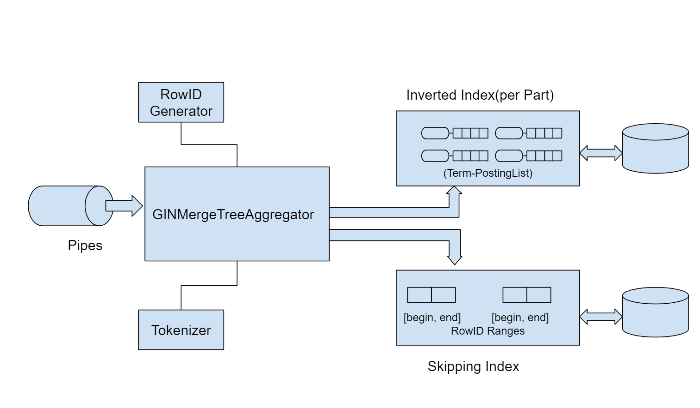
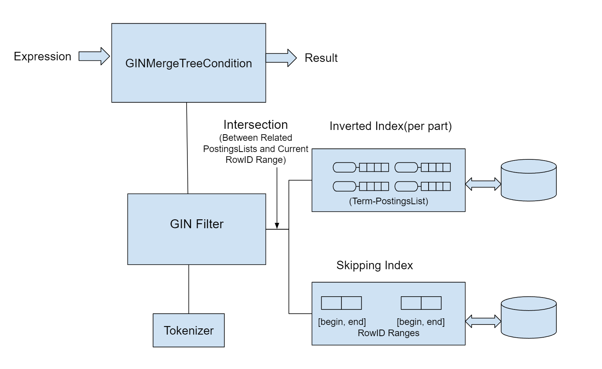
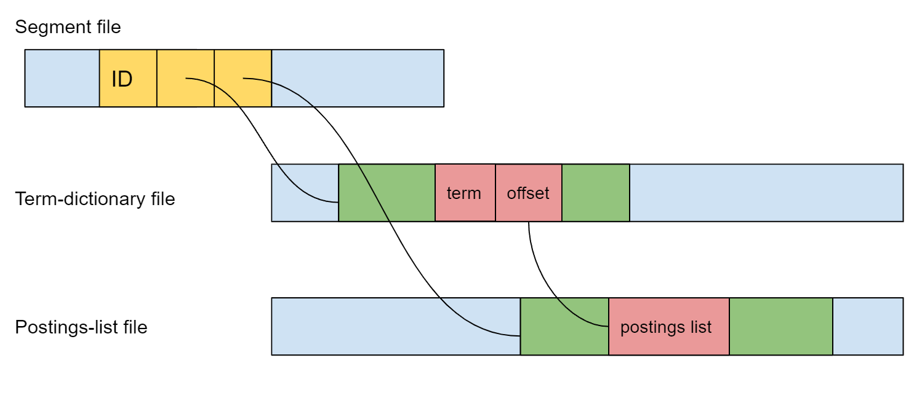

# GIN Full Text Search Index Prototype Design

## 1. Overview

The prototype is to build a full text search engine prototype for ClickHouse. 

The engine is based on Reverted Index and n-gram tokenizer techniques,which should be extensible to support multi language dependent tokenizers and different index storage strategies(In Memory, B-Tree based, LSM Tree-based, etc).

For prototyping, we only need to support bigram tokenization and one index storage strategy.


## 2. Architecture

The Gin Index engine is well-aligned with ClickHouse secondary index(skipping index) architecture, including index creating syntax, block stream piping, expression(RPN) evaluation, etc. However, unlike skipping indexes such as bloom filter(ngrambf_v1), it has an inverted index which can handle indexing work for the whole part.

### 2.1 Syntax Analyzer

Gin index can be created as other ClickHouse index by using following(example):

```sql
CREATE TABLE my_table1  (k UInt64,s String,INDEX my_gin_index(s) TYPE GIN(ngrams(2))  GRANULARITY 1)   Engine=MergeTree ORDER BY (k)

ALTER TABLE my_table2 ADD INDEX my_gin_index(s) TYPE GIN(ngrams(2)) GRANULARITY 1
```
(For prototyping, we use simplified GIN(2) for specifying  parameters).

To implement this syntax, we need to create a registered function:
```c++
void ginIndexValidator(const IndexDescription & index, bool);
```
From the passed IndexDescription, we can get the AST tree and check if the syntax is correct. The implementation is straightforward.

### 2.2 Building GIN Index
#### 2.2.1 Tokenizers

The index creation can accept any ClickHouse tokenizer function(like ngram, alphaTokens, splitByString). We can support a default tokenizer(bigram for example) which is designed for full text search.

#### 2.2.2 RowID Generator

Inverted Index needs to create a postings list for each term. A posting list is a list of positions(a pair of RowID and OffsetInRow) of the term. Since ClickHouse doesn't have RowID, we need to have a RowID Generator. It has following properties :
It can generate unique RowIDs 
The next available RowID is persistent(saved to a file). 
The Generator should be thread-safe
GetRowIDRange() is supported to return a range of RowIDs for better performance.

 #### 2.2.3 GIN MergeTree Index Aggregator

This class is used for creating GIN indexes.  This class accepts block streams from ClickHouse pipes, tokenizes text in the blocks into terms, and for each term, its related posting list is built and saved to index storage.

  

There are two kinds of index storage. One is the index storage for the data part, essentially it stores token-postingList pairs. Another storage is for the skipping index, which stores all the RowID ranges. Each processed block generates one RowID range. Multiple RowID ranges can be merged by optimization algorithm. The purpose of this index storage is for testing if a granule can be skipped or not, more details will be described later.

### 2.3 Using GIN Index

#### 2.3.1 Overview

GIN Search engine has the following components:

  

#### 2.3.2 GIN MergeTree Condition

GinMergeTreeCondition class implements IMergeTreeIndexCondition which is responsible for evaluating expressions. The expression supports "not", "or" and "or" operators and following functions:
- Equals, NotEquals
- Has
- In, NotIn
- Like
- MultiSearch

It calls the GINFilter class(see below) to do string matching when evaluating "leaf nodes" in the expression tree.

#### 2.3.3 GIN Filter

GinFilter has the core functionality for string matching. It tokenizes the input string which comes from the expression into terms. For each term, it gets the term's postings list from inverted index, and uses posting list intersection algorithms to test term membership in the current RowID ranges which are retrieved from skipping index. If all the term's membership tests are passed, GIN Filter will return true.

# 3. Index Engine

## 3.1 Index Construction Algorithm
The core algorithm for constructing gin index  is based on Single-Pass In-Memory Indexing(SPIMI, see Reference[1]) algorithm. 

 - There are following steps in the algorithm:
 - Read text from blocks, and build terms and postings lists.
 - When the data reaches the threshold in the setting, it will:
   - Save segment information to the segment file.
   - Save postings list(implemented as roaring bitmaps, See Reference[2]) to postings-list file.
   - Save the terms and their offset to the postings-list files to the term-dictionary file.
 - (Optional) Merge index files of all segments into final index files.

##  3.2 Index Query Algorithms
Index Query can work on segmented indexes(final form of index can be treated as index of one segment). There are 3 types of index data, the following is their relationships with memory:

 - Segment data 		- loaded in memory
 - Term dictionaries 	- loaded in LRU cache 
 - Postings lists 		- only postings lists of terms in query are loaded in memory

When executing the query, the following steps will be followed:
 - The index's segment data will be loaded in the memory. Term dictionaries are loaded into memory on demand and removed by LRU algorithm.
 - Get the set of terms from the query by tokenizer, and for each term, read its postings lists from postings-list file by using segment data and term dictionaries in memory.
 - Do intersection operations among the retrieved postings lists and row ID ranges in the skip index for every segment, and return true or false results to the upper layer.

## 3.3 Index Format

### 3.3.1 Segment File

The 3 types of index file format has the following relationship:

  

Segment file contains segment information of the index. It stores an array of segment information record which includes:
 - Segment ID
 - Starting file pointer to the postings-list file
 - Starting file pointer fo the term-dictionary file

### 3.3.2 Term Dictionary File

Term-dictionary file stocontains res all segment's term dictionaries. It stores an array of term dictionary information record which includes:
 - Term token length
 - Term token value
 - offset to term's postings list in postings-list file

Note that the record can be in FST (Finite State Transducer, see reference[3]) format.

### 3.3.3 Postings List File
Postings list file contains all postings lists of the index. It stores an array of postings list which includes:
 - Posting list length
 - Encoded Roaring bitmap


# References

[1] Heinz, Steffen, and Justin Zobel. 2003. Efficient single-pass index construction for
text databases. JASIST 54(8):713–729.

[2] Roaring Bitmap https://github.com/RoaringBitmap/RoaringBitmap

[3] FST(Finite State Transducer) Direct Construction of Minimal Acyclic Subsequential Transducers

