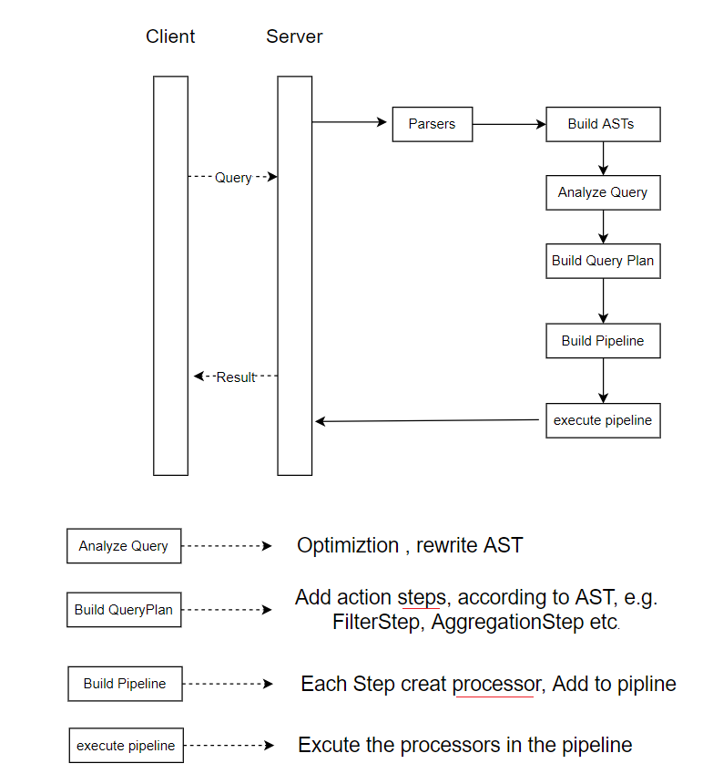
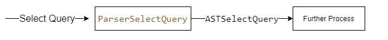
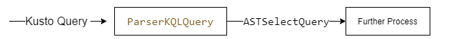
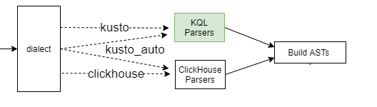
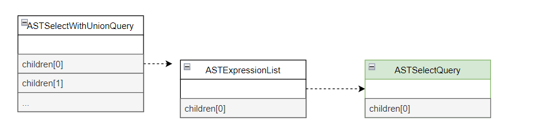
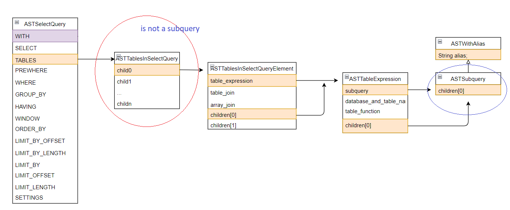
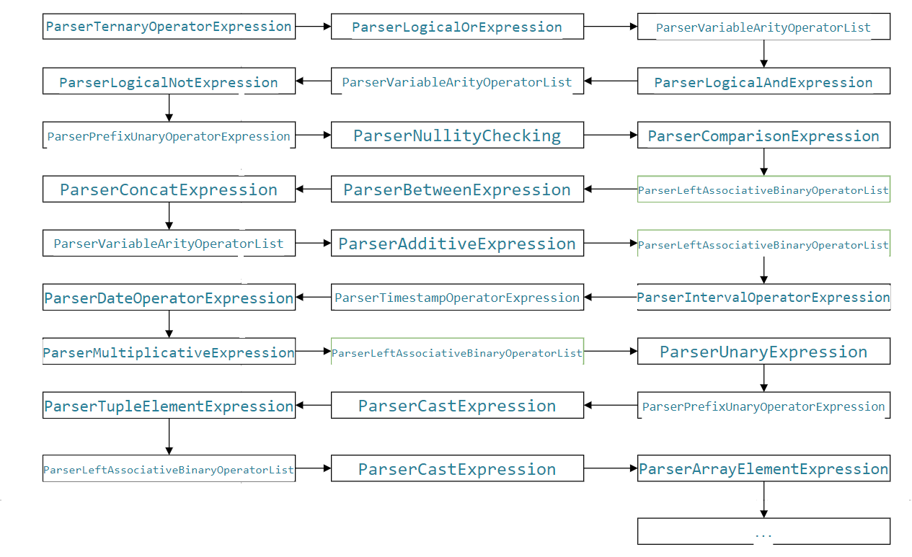

# Kusto Support in ClickHouse

## ClickHouse High level view  
  

## Kusto query :
- ### Query statement
    - A `tabular` expression statement
    - A let statement
    - A set statement
- ### Control command
    - Requests to Kusto to process or modify data or metadata  
        start with the dot (.) e.g:  
        .create table


## Process tabular expression statement in ClickHouse:
 So far, we processed tablaor the KQL process is 
The KQL is a query with output , similar to the SQL select query. 

ClickHouse first parse the select query to ASTSelectQuery , then do further process:  
  

So for KQL, also parse to ASTSelectQuery first:  
  


## KQL dialect:  
  

- Dialect is used to isolate the KQL from ClickHouse SQL.

    - default dialect is `clickhouse`

    - `dialect = clickhosue`  
        olny SQL query will be processed 
    - `dialect = kusto`  
        only KQL query will  be processed
    - `dialect = kusto_auto`  
        both SQL and KQL can be processed  

[check dialect in clickhouse ](
https://github.com/ClibMouse/ClickHouse/blob/Kusto-phase3/src/Interpreters/executeQuery.cpp#L361)
- Command to swith dialect  
    ```
        set dialect = 'clickhouse'  
        set dialect = 'kusto'  
        set dilalect = 'kusto_auto'  
    ```
- Start server with dialect  
Set dialect setting in server configuration XML at user level(`users.xml`). This sets the dialect at server startup and CH will do query parsing for all users with default profile acording to dialect value.
For example: 
    ```
    <profiles> <!-- Default settings. --> 
        <default> 
            <load_balancing>random</load_balancing> 
        ...
        <dialect>kusto_auto</dialect>
        ...
        </default>
    ```

- Start `clickhouse-client` with dialect:  
    ./programs/clickhouse-client "--multiquery" --dialect='kusto_auto'
- Start `clickhouse-local` with dialect  
    ./programs/clickhouse-local "--multiquery" --dialect='kusto_auto'

    demo  


## KQL parser  
- Parse KQL to ASTSelectQuery.

    one complete KQL tabular  -> one SQL Select Qury.
    the  AST after parsing is:
      

    ASTSelectQuery is the AST used for getting result( queryplan, pipelint etc.)  

    for single KQL query (without union), the destination is the `ASTSelectQuery`

    we create a KQL parser, and used by clickhouse to create ASTs.

    [calling ParserKQLStatement](
https://github.com/ClibMouse/ClickHouse/blob/Kusto-phase3/src/Interpreters/executeQuery.cpp#L363) (the point to call KQL parser in clickhouse)

    [ParserKQLStatement](https://github.com/ClibMouse/ClickHouse/blob/Kusto-phase3/src/Parsers/Kusto/ParserKQLStatement.cpp#L13) (KQL parser entry point)
    
    [call ParserKQLQuery](https://github.com/ClibMouse/ClickHouse/blob/Kusto-phase3/src/Parsers/Kusto/ParserKQLStatement.cpp#L43)   
    [ParserKQLQuery](https://github.com/ClibMouse/ClickHouse/blob/Kusto-phase3/src/Parsers/Kusto/ParserKQLQuery.cpp#L530) (the core implementation of KQL parser)

- What to parse   
    currently :  
    [KQL DataTypes](https://learn.microsoft.com/en-us/azure/data-explorer/kusto/query/scalar-data-types/)  
    [KQL tabular operators](https://learn.microsoft.com/en-us/azure/data-explorer/kusto/query/queries)  
    [KQL scalar/aggregation functions](https://learn.microsoft.com/en-us/azure/data-explorer/kusto/query/scalarfunctions)  
    [KQL string/scalar operators](https://learn.microsoft.com/en-us/azure/data-explorer/kusto/query/datatypes-string-operators)  

    to do:  
    parse KQL experission for error message.

- Tools to parse  
    - token  
    [clickhouse token](https://github.com/ClibMouse/ClickHouse/blob/Kusto-phase3/src/Parsers/Lexer.h#L88)  
    [token type](https://github.com/ClibMouse/ClickHouse/blob/Kusto-phase3/src/Parsers/Lexer.h#L9)  
    to do:  
    KQL token
    - clickhouse expression parser, e.g  
        ParserExpressionList
    - clickhouse sub clause parser, e.g  
        ParserOrderByExpressionList

- KQL operator parsers:   

    table | operator1 | operator2| ..

    each operator parser either to generate a ASTSelectQuery or a part of ASTSelectQuery.

    this handle by the class [ParserKQLQuery](https://github.com/ClibMouse/ClickHouse/blob/Kusto-phase3/src/Parsers/Kusto/ParserKQLQuery.h#L22)  

    - Add new operator parser class:  
        e.g:

    - Add an entry of [struct KQLOperatorDataFlowState](https://github.com/ClibMouse/ClickHouse/blob/Kusto-phase3/src/Parsers/Kusto/ParserKQLQuery.h#L25)  
    in [ParserKQLQuery](https://github.com/ClibMouse/ClickHouse/blob/Kusto-phase3/src/Parsers/Kusto/ParserKQLQuery.cpp#L44)    
    - Add code to generate the parser [instance](https://github.com/ClibMouse/ClickHouse/blob/Kusto-phase3/src/Parsers/Kusto/ParserKQLQuery.cpp#L368)  
    - Implement the method parseImpl  
        call [getExprFromToken](https://github.com/ClibMouse/ClickHouse/blob/Kusto-phase3/src/Parsers/Kusto/ParserKQLQuery.cpp#L214)  to convert expressions to ClickHosue expressions.
    - [update subquery source](https://github.com/ClibMouse/ClickHouse/blob/Kusto-phase3/src/Parsers/Kusto/ParserKQLFilter.cpp#L21)  

      or  
    - [update subquery source](https://github.com/ClibMouse/ClickHouse/blob/Kusto-phase3/src/Parsers/Kusto/ParserKQLJoin.cpp#L280)   
      

- KQL function parsers:  
    [An enumerate function id in the function table](https://github.com/ClibMouse/ClickHouse/blob/Kusto-phase3/src/Parsers/Kusto/KustoFunctions/KQLFunctionFactory.h#L9)  
    [Map function name to function id](https://github.com/ClibMouse/ClickHouse/blob/Kusto-phase3/src/Parsers/Kusto/KustoFunctions/KQLFunctionFactory.cpp#L16)  
    [Function class](https://github.com/ClibMouse/ClickHouse/blob/Kusto-phase3/src/Parsers/Kusto/KustoFunctions/KQLCastingFunctions.h#L7)  
    [Function instance](https://github.com/ClibMouse/ClickHouse/blob/Kusto-phase3/src/Parsers/Kusto/KustoFunctions/KQLFunctionFactory.cpp#L239)  
    [implement convertImpl](https://github.com/ClibMouse/ClickHouse/blob/Kusto-phase3/src/Parsers/Kusto/KustoFunctions/KQLCastingFunctions.cpp#L12)  
    [getArgument ](https://github.com/ClibMouse/ClickHouse/blob/Kusto-phase3/src/Parsers/Kusto/KustoFunctions/KQLCastingFunctions.cpp#L18)  

    [native clickhouse functions](https://github.com/ClibMouse/ClickHouse/tree/Kusto-phase3/src/Functions/Kusto)  
    [some tips for working with clickhouse functions](https://github.ibm.com/ClickHouse/ClickHouse/wiki/Working-with-ClickHouse-Functions)  
## Improvement  
-KQL Token / Lexer 
   scalar / string operators 
   pipeline | 
   digital 
    
-KQL Expression parser  
+, -,  *,  /, and, or, etc.


- Go deeper than parser:  
    - Native functions  
    
    - KQL operator ASTs -> KQL operator step -> KQL operator processors 
        more to come.