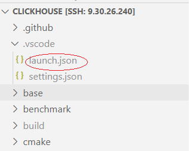
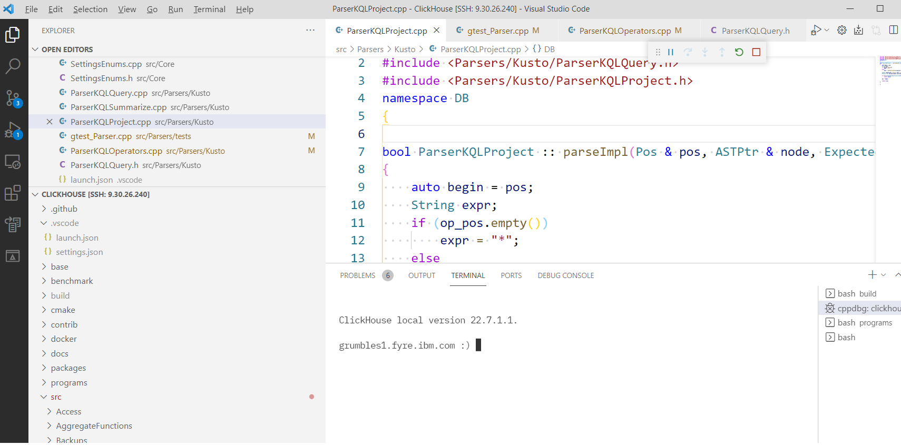
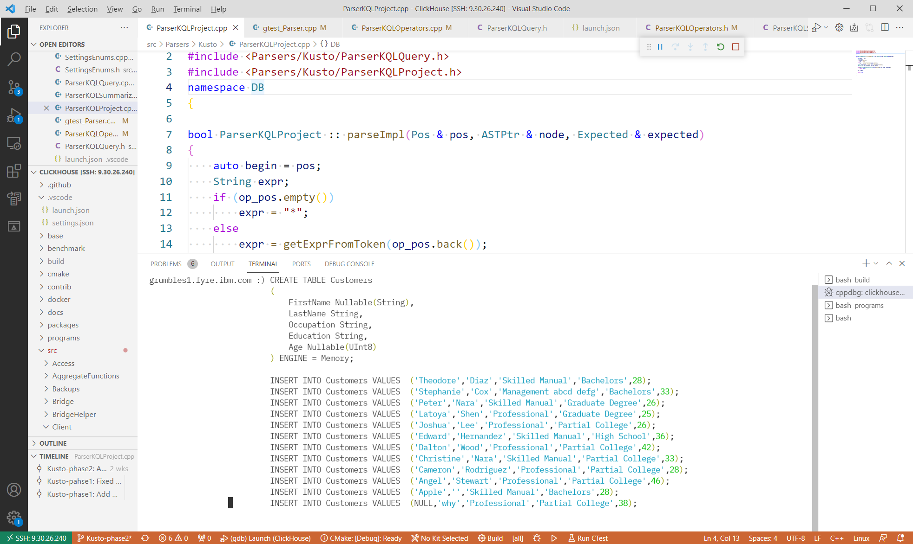
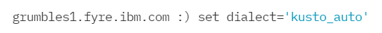
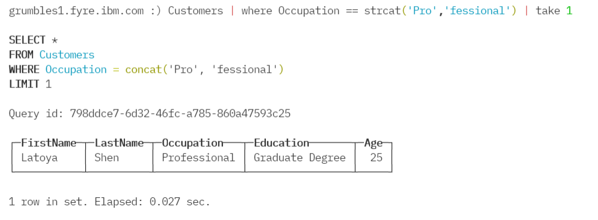
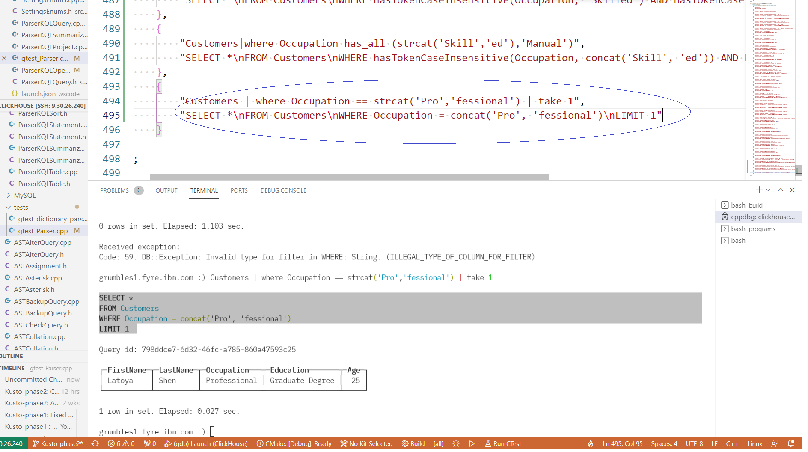
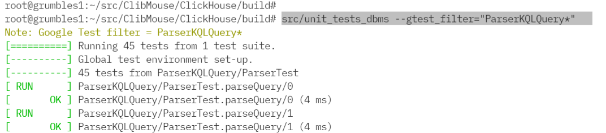
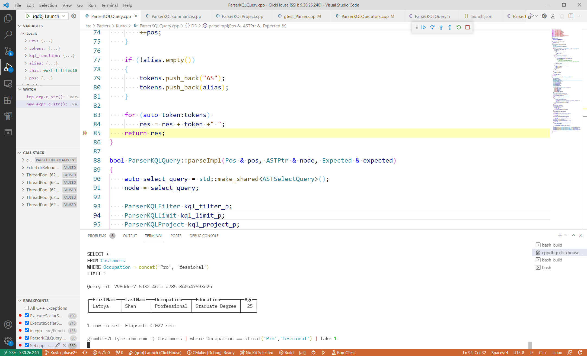
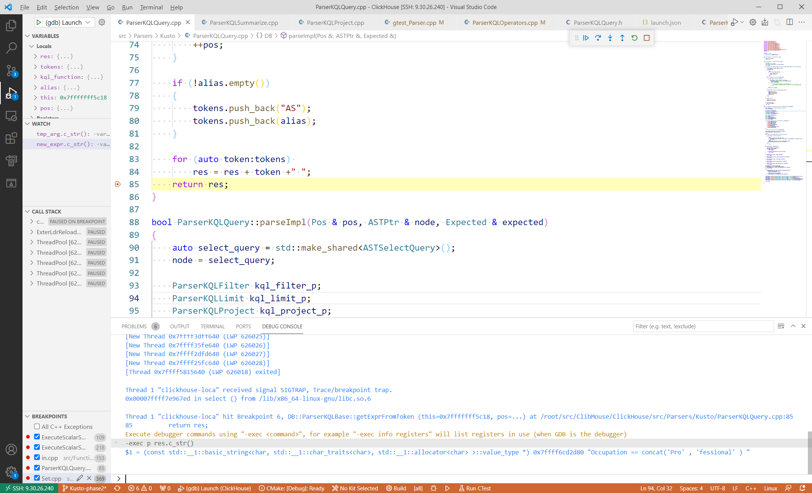

# KQL development Test and Debug.

make sure gdebug and vscode c++ extenstion installed.


## 1.  Config launch.json in vs code
- Under the CLICKHOUSE folder, create a `.vscode` folder ( if not exist)  
  
- inside `.vscode` folder , edit or create 'launch.json' file config as :
```
{
    "version": "0.2.0",
    "configurations": [
        {
            "name": "(gdb) Launch",
            "type": "cppdbg",
            "request": "launch",
            "program": "${workspaceFolder}/build/programs/clickhouse-local",
            "args": ["--multiquery"],
            "stopAtEntry": false,
            "cwd": "${workspaceFolder}",
            "environment": [],
            "externalConsole": false,
            "MIMode": "gdb",
            "setupCommands": [
                {
                    "description": "Enable pretty-printing for gdb",
                    "text": "-enable-pretty-printing",
                    "ignoreFailures": true
                },
                {
                    "description": "ignore SIGUSR1 signal",
                    "text": "handle SIGUSR1 nostop noprint pass"
                },
                {
                    "description": "ignore SIGUSR2 signal",
                    "text": "handle SIGUSR2 nostop noprint pass"
                }
            ]
        }
    ]
}
```

here use `clickhouse-local` to test and debug, and use `--multiquery` for easy inserting data

## 2. Start debuger
- Select from menu `Run -> Start debugging` or press `F5`, this will take several minutes:  
   

## 3. Create table and insert data
copy the follwing script to the debug terminal:
```
CREATE TABLE Customers
(    
    FirstName Nullable(String),
    LastName String, 
    Occupation String,
    Education String,
    Age Nullable(UInt8)
) ENGINE = Memory;

INSERT INTO Customers VALUES  ('Theodore','Diaz','Skilled Manual','Bachelors',28);
INSERT INTO Customers VALUES  ('Stephanie','Cox','Management abcd defg','Bachelors',33);
INSERT INTO Customers VALUES  ('Peter','Nara','Skilled Manual','Graduate Degree',26);
INSERT INTO Customers VALUES  ('Latoya','Shen','Professional','Graduate Degree',25);
INSERT INTO Customers VALUES  ('Joshua','Lee','Professional','Partial College',26);
INSERT INTO Customers VALUES  ('Edward','Hernandez','Skilled Manual','High School',36);
INSERT INTO Customers VALUES  ('Dalton','Wood','Professional','Partial College',42);
INSERT INTO Customers VALUES  ('Christine','Nara','Skilled Manual','Partial College',33);
INSERT INTO Customers VALUES  ('Cameron','Rodriguez','Professional','Partial College',28);
INSERT INTO Customers VALUES  ('Angel','Stewart','Professional','Partial College',46);
INSERT INTO Customers VALUES  ('Apple','','Skilled Manual','Bachelors',28);
INSERT INTO Customers VALUES  (NULL,'why','Professional','Partial College',38);
```
  

## 4. Set dialect
`set dialect='kusto_auto'`  
or  
`set dialect='kusto'`  

  
## 5. Test KQL query
example: test function `strcat`  

`Customer | where Occupation == strcat('Pro','fessional') | take 1`  
  

## 6. Add to unit test
check teh test result , if correct add to unit test:
`src/Parsers/tests/gtest_Parser.cpp`

in the part **INSTANTIATE_TEST_SUITE_P(ParserKQLQuery** :
  

## 7. Run unit test after build:
inside the build folder, run  
 `src/unit_tests_dbms --gtest_filter="ParserKQLQuery*"`   

  

## 8 Debug 

if the result is not expected, we can set break point to debug  

  

## 9  check content
we want to see the content of std:string res:  
type `-exec p res.c_str()` under teh tab `DEBUG CONSOLE`

  